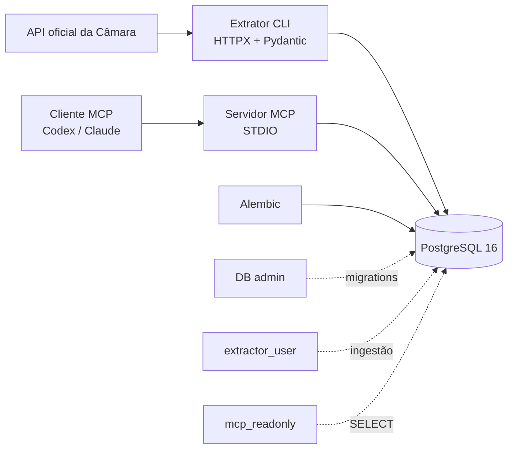

# Public Data MCP

MVP de case técnico para extrair deputados federais em exercício da API oficial de Dados Abertos da Câmara dos Deputados, validar e normalizar os dados, armazená-los no PostgreSQL e disponibilizar consultas seguras via Model Context Protocol (MCP).

## Problema e solução

O projeto transforma uma fonte pública paginada em uma base consultável por agentes de IA. O extrator é executado sob demanda, registra cada ingestão e faz upsert idempotente por `external_id`. O servidor MCP consulta somente o banco e não possui ferramentas de escrita ou SQL arbitrário.

## Arquitetura



## Tecnologias

Python 3.12+, `uv`, PostgreSQL 16, SQLAlchemy 2, Psycopg 3, Alembic, Pydantic, `pydantic-settings`, HTTPX, SDK oficial do MCP v2, Pytest, Ruff e Docker Compose.

## Estrutura

```text
apps/extractor/       cliente, schemas, normalização, pipeline e CLI
apps/mcp_server/      servidor STDIO, repositório e ferramentas
packages/shared/      configuração, engines e models SQLAlchemy
migrations/           migrations Alembic
tests/                testes unitários e de integração
docker/               inicialização de usuários e privilégios
```

## Pré-requisitos

- Python 3.12 ou superior
- Docker Desktop com o daemon em execução
- `uv` (pode ser instalado com `python -m pip install --user uv`)

## Configuração

Copie `.env.example` para `.env` e substitua as credenciais de exemplo:

```powershell
Copy-Item .env.example .env
```

O `.env` é ignorado pelo Git. Há três conexões conceituais: a administrativa para migrations, `extractor_user` para ingestão e `mcp_readonly` para o servidor MCP.

## Instalação e banco

```powershell
uv sync
docker compose up -d postgres
uv run alembic upgrade head
```

O Compose cria o PostgreSQL 16, volume persistente, healthcheck e os usuários necessários na primeira inicialização do volume. Se o Docker Desktop estiver parado, inicie-o e repita o comando.

## Ingestão

```powershell
uv run python -m apps.extractor.cli sync
```

O pipeline percorre todas as páginas seguindo `rel=next`, aplica timeout e retentativas limitadas, valida cada registro, normaliza strings, faz upsert por `external_id` e registra métricas em `ingestion_runs`. Uma coleta completa também reativa registros presentes e marca como inativos os ausentes. Registros rejeitados são contabilizados e registrados com contexto seguro.

## Servidor MCP

```powershell
uv run python -m apps.mcp_server.server
```

O processo usa STDIO; não escreva mensagens de diagnóstico em `stdout`. Para configurar um cliente local, use um caminho portátil equivalente a:

```json
{
  "mcpServers": {
    "public-data-mcp": {
      "command": "uv",
      "args": ["run", "python", "-m", "apps.mcp_server.server"],
      "cwd": "<CAMINHO_DO_PROJETO>"
    }
  }
}
```

No Codex, adicione o servidor MCP local apontando `cwd` para a raiz do projeto. No Claude Desktop, coloque a mesma entrada no arquivo de configuração MCP correspondente ao seu sistema operacional. Nunca substitua o placeholder por um caminho específico em arquivos versionados.

## Ferramentas MCP

- `search_deputies`: busca parcial e case-insensitive por nome, com filtros opcionais de partido e UF, paginação e limite máximo de 100.
- `get_deputy_by_id`: consulta por `external_id` oficial.
- `count_deputies_by_party`: conta por partido, opcionalmente filtrando por UF.
- `count_deputies_by_state`: conta por estado, opcionalmente filtrando por partido.
- `get_data_freshness`: informa última ingestão bem-sucedida, quantidade atual, fonte, status e registros processados.

Exemplos de perguntas: “Liste os deputados de São Paulo”, “Procure deputados cujo nome contenha Silva”, “Quantos deputados existem por partido?” e “Quando os dados foram atualizados pela última vez?”.

## Segurança

- O MCP usa `mcp_readonly` e somente consultas parametrizadas.
- Não existe ferramenta de SQL arbitrário nem operação de inserção, alteração ou exclusão.
- Credenciais ficam em variáveis de ambiente e não são registradas.
- Limites de entrada e paginação são validados.
- O extrator e o usuário administrativo são separados do usuário de leitura.
- Falhas internas são registradas no servidor sem expor detalhes de conexão ao cliente.

## Testes e qualidade

```powershell
uv run pytest
uv run ruff check .
uv run ruff format --check .
```

Os testes unitários simulam a API e cobrem validação, normalização, paginação, limite MCP, ausência de deputado e idempotência básica. Testes que exigirem PostgreSQL devem ser executados com o Compose ativo.

## Limitações conhecidas

- A ingestão é sob demanda; não há agendador no MVP.
- `source_updated_at` fica nulo quando a listagem da API não fornece uma data confiável.
- O teste de integração real depende de um Docker Desktop em execução.
- O servidor MCP é local via STDIO e não inclui autenticação de rede.

## Possíveis evoluções

- Agendamento externo da CLI.
- Histórico de alterações dos deputados.
- Métricas e alertas operacionais.
- Testes de integração automatizados em CI com PostgreSQL.
- Transporte MCP remoto somente se houver requisito futuro de implantação.
